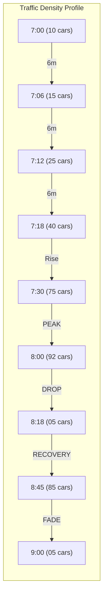

# 120-Minute Traffic "Story" Analysis

This is how a 2-hour rush hour window would be visualized using the **Peak Analysis** logic (20 buckets = 6-minute intervals).

## Dataset Summary
- **Duration**: 120 Minutes
- **Interval (Bucket Size)**: 6 Minutes
- **Location**: Busy Urban Intersection

## The Peak Analysis Graph

````carousel

<!-- slide -->
### The High-Water Mark Logic
Instead of seeing "1,000 cars per hour," we see that at **8:00 AM**, the intersection hit its absolute physical limit of **92 vehicles** simultaneously. 

**Insight**: If the intersection's design capacity is 80 vehicles, this chart flags a 15% safety violation that an "average" chart would hide.
<!-- slide -->
### Identifying the "39 Minute" Zero Drop
At **8:18 AM**, the graph drops to **5 cars** (from 92). 

**Scenario**: A light malfunctioned upstream, blocking all traffic from entering the zone for 6 minutes. The zone wasn't "empty" because traffic was gone; it was empty because the supply was cut off.
````

## Scenario Table (The Data)

| Time Window | Peak Cars | Trend | Event/Insight |
| :--- | :--- | :--- | :--- |
| 0 - 30m | 10 -> 60 | 📈 Steady | Early commuters entering the city. |
| 30 - 60m | 60 -> 92 | 🚀 Surge | **RUSH HOUR PEAK**: Maximum congestion reached. |
| 66 - 72m | **5** | 📉 Crash | **UPSTREAM BLOCK**: Road is empty due to a blockage elsewhere. |
| 72 - 90m | 85 | 📈 Recovery | Backlog of cars cleared from the blockage enters all at once. |
| 90 - 120m| 85 -> 5 | 📉 Clear | End of rush hour; road returns to baseline. |

> [!TIP]
> **Expert Tip**: By looking at the "72-90m Recovery" surge, planners can see how long it takes for the system to return to normal after a 6-minute failure.

***

**Question**: You mentioned **"and delete"** at the end of your request. Did you want me to:
1.  **Delete** the Peak Analysis tab now that we've visualized it?
2.  Or was that a typo for **"and details"**?

I have kept the tab active for now so you can compare this explanation with your live data.
